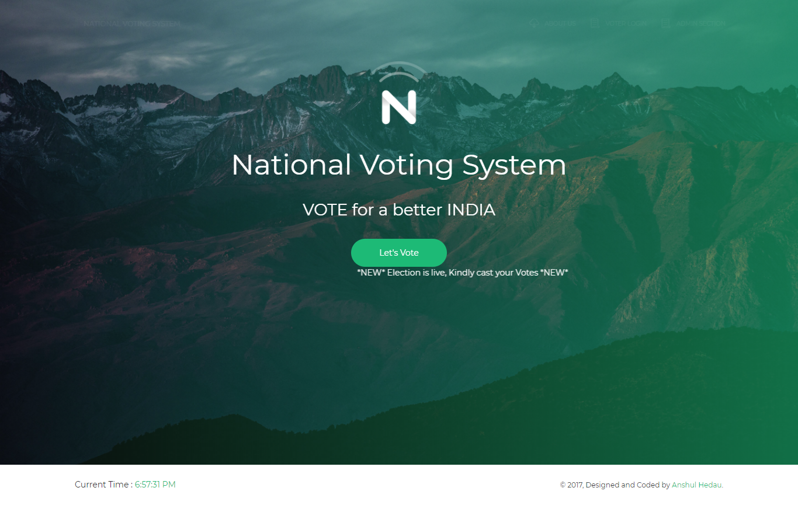
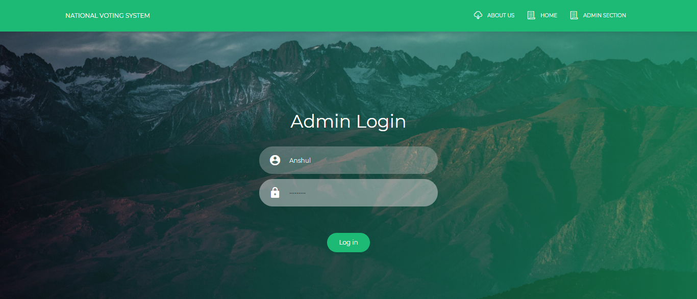
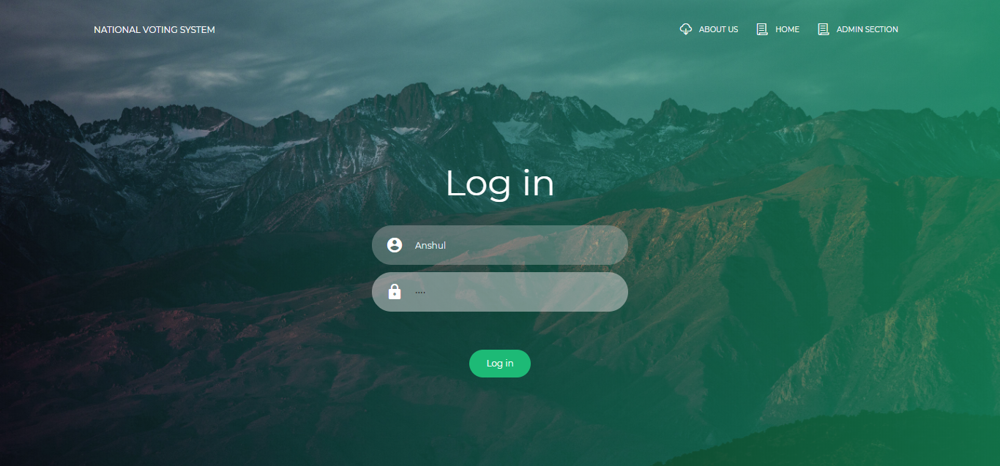
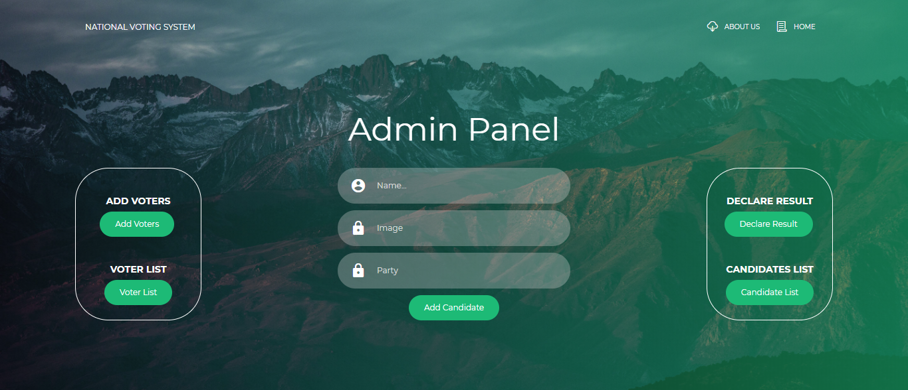
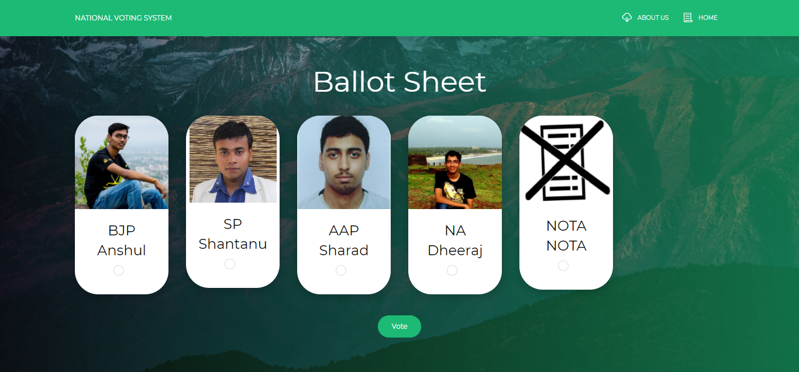
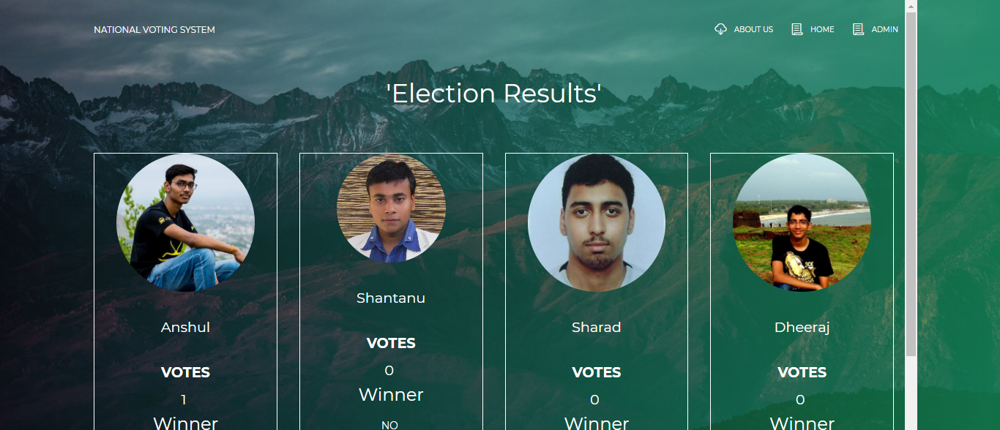

 # Online-Voting-System
Online National Election System is a dynamic website designed for the
welfare of common people of this country. It would have voter registration
and login as well. The voter shall login with the voter id which will lead
him to his profile page from where he can start voting.He will also be able
to view the election results once the election gets over. The Admin login
which will be handled by the election commission of India will have the
power to view and delete the list of candidates and voters. The admin will
can also declare the results once the election gets over. So with the use
of this application people shall be able to vote sitting in their homes,
offices or anywhere and anytime.

## Language Used
The website was designed successfully with the help of HTML, CSS,
JAVASCRIPT and BOOTSTRAP and AJAX for the front end and PHP
for the backend. The Bootstrap used is based on the creative Tim UI Kit.

## Description  
The modules developed in the website are as follows:

### Landing Page
This page is the home page of our website which contains various logins of user as well as the admin.

### Admin Login
In this page the admin shall be able to add the candidate as well as the voter details. The admin shall also be able to view the list of voters as well as candidates. He can also declare the results once the election gets over.

### Voter Login
In this page the voter shall be able to login by inserting the details such as login id and password. Voter Profile

### Voter Profile
The voter shall be able to view his profile where his date of birth, eligibility, and age and profile pic will also be displayed. From this page the voter shall be able to start voting. Once the elections get over the voter can view the results and cannot vote more than once. The option to vote will be removed as soon as the results are declared.

### Ballot Page
The ballot page will help the voters to choose the candidate of choice. Various candidates those who are eligible in the election.  

### Result Page
In this page we are displaying the winner of the elections in which a congratulatory message is displayed along with the name of the winner.  

### Voter Registration
In this page the voter shall be able register by inserting the details like voter-id, date of birth, mob number, address, and email-id and can upload the image as well.

### Voter’s List
In this page the list of voters shall be displayed where admin has the power to delete the voter from the voting list. When the admin clicks on details all the details of voter shall be displayed

### Candidates List
In this page we are displaying the list of candidates who are eligible and are standing in the current election. The candidates can be deleted and the details of the candidate can also be viewed

### Vote count Page
In this page we are displaying the count of votes which each candidate has got after the elections are conducted.  

## Project can be viewed at
URL Link - http://onlinevoting.gearhostpreview.com/
